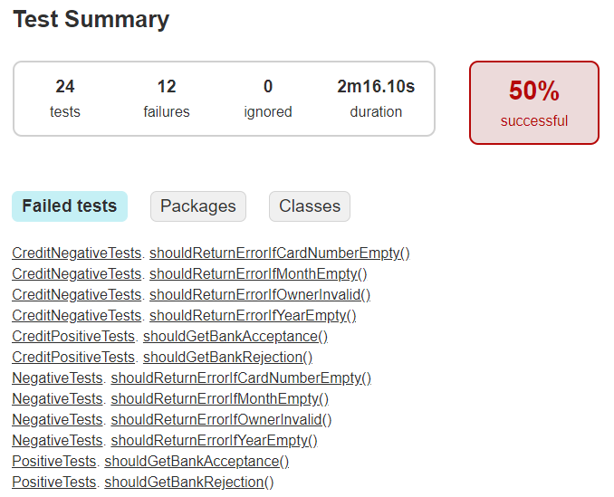

## Отчет по итогам тестирования ##
1. **Краткое описание**: Созданы автотесты согласно перечню автоматизируемых сценариев (файл Plan.md)
2. **Количество тест-кейсов**: 24
3. **% успешных/не успешных**: 12 тестов (50%) прошло, 12 тестов (50%) упало

4. **Общие рекомендации**: исправить ошибки приложения и повторить тесты